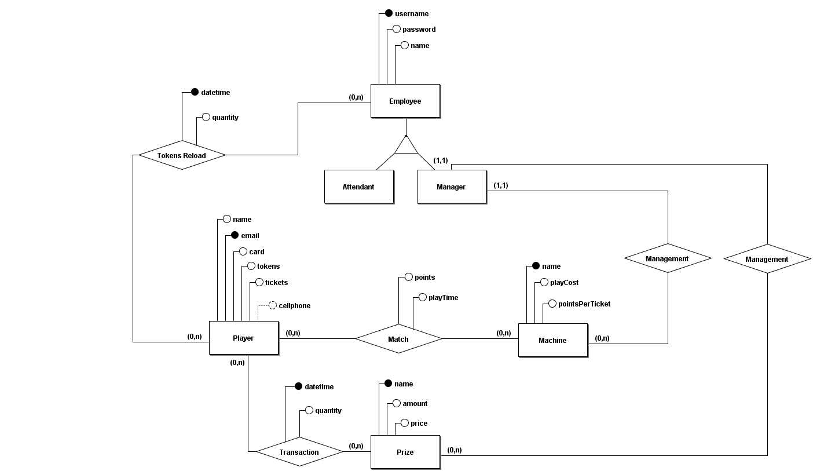

# Como rodar o banco localmente

1. Instalar docker - [link](https://www.docker.com/get-started/)

2. Inicializar container com o postgres

- Linux

  ```shell
  start-database.sh
  ```

- Windows

  ```cmd
  start-database.bat
  ```

  Pronto!

## Acessar o banco utilizando um SGBD

- server: `localhost`
- username: `flipman`
- senha: `123456`

- Eu recomendo o [Azure Data Studio](https://docs.microsoft.com/en-us/sql/azure-data-studio/download-azure-data-studio?view=sql-server-ver16), com a extensão para Postgres, mas pode ser qualquer outro.

## Modelagem ER


